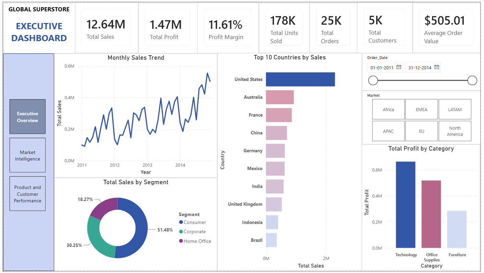
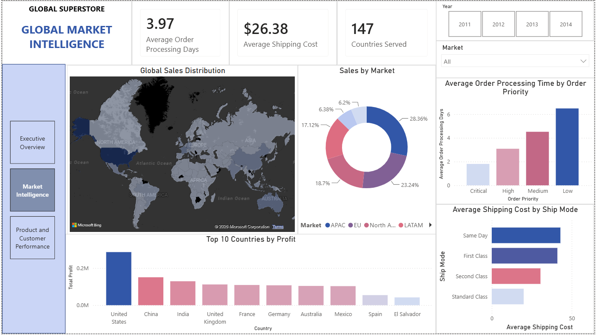
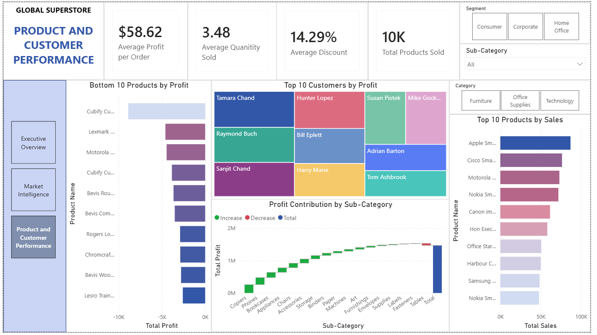

# Global-Sales-Market-Intelligence
Power BI analysis of global retail data, exploring sales, profitability, market performance, products, customers, and shipping to uncover key business insights.

## Executive Summary
Analysis of Global Superstore sales data using SQL Server and Power BI to understand overall business performance, product and customer performance, and global market performance.

The project focuses on turning transactional sales data into actionable business insights through three interactive Power BI dashboards.

Dataset Link: https://www.kaggle.com/datasets/fatihilhan/global-superstore-dataset 

***
## Business Problem
The business needs to evaluate sales and profitability across its products, customers, and global markets to identify key performance drivers, underperforming areas, and operational inefficiencies. The analysis aims to provide data-driven insights that can support decisions around product performance, customer value, market expansion, and operational costs.

### Business Questions:
1. How is the business performing in terms of sales, profitability, and growth?
2. Which products, categories, and customers contribute most to business performance?
3. Which products and areas are underperforming or reducing profitability?
4. Which global markets and countries generate the strongest sales and profits?
5. How do discounts, shipping costs, and order processing times affect business performance?
6. Where are the biggest opportunities to improve profitability and operational efficiency?

## Analysis and Findings

### Dashboard 1 - Executive Overview
**Business Question -** How is the business performing overall, and what are the key drivers of sales and profitability?

**Dashboard:**  

**Key Findings**
1. The business generated $12.64M in sales and $1.47M in profit, resulting in an 11.61% profit margin.
2. Sales show an overall upward trend from 2011 to 2014, despite noticeable month-to-month fluctuations.
3. The Consumer segment contributes the largest share of sales (51.48%), followed by Corporate (30.25%) and Home Office (18.27%).
4. The United States is the leading country by sales, substantially ahead of the other top-performing countries.
5. Technology generates the highest profit among the three categories, while Furniture contributes considerably less.

### Dashboard 2 — Global Market Intelligence
**Business Question -** Which markets and countries are driving global performance, and where are there opportunities to improve operational efficiency?

**Dashboard:**  

**Key Findings**
1. APAC contributes the largest share of sales (28.36%), followed by EU (23.24%) and North America (18.70%).
2. The United States is the strongest country by profit, followed by China and India.
3. The business operates across 147 countries, demonstrating a broad global presence.
4. Average order processing time is 3.97 days, but processing time varies significantly by order priority. Interestingly, Low-priority orders take the longest to process, at approximately 6.5 days.
5. Same Day and First Class shipping have the highest average shipping costs, while Standard Class has the lowest.

### Dashboard 3 — Product & Customer Performance
**Business Question -** Which products and customers are driving profitability, and where are there opportunities to improve product performance?

**Dashboard:**  

**Key Findings**
1. The business generates an average of $58.62 profit per order.
2. The average discount is 14.29%, providing an important area to monitor when evaluating profitability.
3. Technology-related products are strong profit contributors, consistent with the category-level performance seen in the Executive Overview.
4. A small group of customers contributes a significant amount of profit, highlighting the importance of high-value customer retention.
5. Several products generate negative profit, indicating potential opportunities to review pricing, costs, discounts, or product strategy.
6. Profit contribution varies substantially across sub-categories, with some sub-categories contributing much more than others.

## Business Recommendations
- Focus more on high-profit products, especially Technology products, and review products that consistently make a loss.

- Review discount levels to make sure discounts are not reducing profit too much.

- Retain high-value customers by understanding what they buy and offering targeted promotions.

- Improve order processing, especially for Low-priority orders, which currently take the longest to process.

- Control shipping costs by reviewing the use of expensive shipping methods such as Same Day and First Class.

- Focus on strong markets and countries while investigating why other markets perform less well.

- Use profit alongside sales when making decisions so that high sales do not hide low-profit products or markets.

- Review loss-making products and consider changing their pricing, reducing costs, or removing them if they continue to underperform.

